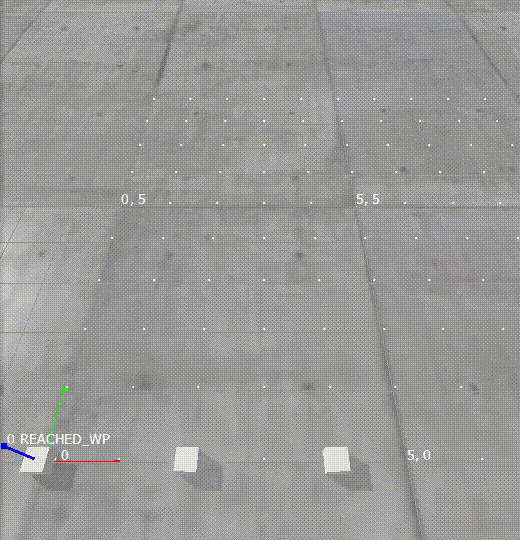

# RMF2 MAPF Robot Execution System (RES)
[](LICENSE)


Coordination and robust execution of Multi-Agent Path Finding (MAPF) plans.

RES takes the solution produced by a classical MAPF solver and executes it on robots, preserving the dependencies between robot moves and replanning on the
fly as robots receive new destinations.



---

## Table of Contents

- [How It Works](#how-it-works)
- [Packages](#packages)
- [Getting Started](#getting-started)
- [Usage](#usage)
  - [Local demonstration](#local-demonstration)
  - [Demonstration with ROS 2 nodes](#demonstration-with-ros-2-nodes)
- [ROS 2 Interface](#ros-2-interface)
  - [`plan_server_node`](#plan_server_node)
  - [`plan_executor_node`](#plan_executor_node)
  - [Messages](#messages)
- [Integration](#integration)
- [References](#references)

---

## How It Works

1. A classical MAPF problem is solved with a MAPF solver. The solution is a list of
   positions that agents should move to at each timestep.
2. Plans are generated from the solution, capturing the dependencies between agent moves -
   an agent must vacate a location before another agent may move into it.
3. A subclass of `BaseRobotController` defines how each move is executed.
4. Actions are queued for execution by the agents. As actions complete, or when replanning
   is required, plans are updated.
5. As agents receive new destinations, replanning occurs while other agents keep moving,
   maintaining the dependencies.

---

## Packages

| Package | Description |
| --- | --- |
| [`res_mapf_planning`](res_mapf/packages/res_mapf_planning) | MAPF solving and plan generation. |
| [`res_plan_execution`](res_mapf/packages/res_plan_execution) | Plan execution and robot controllers. |
| [`res_plan_server`](res_mapf/packages/res_plan_server) | Plan server coordinating agents. |
| [`res_pybullet`](res_mapf/packages/res_pybullet) | PyBullet simulation environment. |
| [`res_ros2`](res_ros2) | ROS 2 nodes (plan server, plan executor). |
| [`res_ros2_msgs`](res_ros2_msgs) | ROS 2 message definitions. |

---

## Getting Started

### Setup with uv

**1. Install uv.** Install the [uv](https://docs.astral.sh/uv/) Python package manager:

```bash
curl -LsSf https://astral.sh/uv/install.sh | sh
```

**2. Build the colcon plugins required for uv support.** The packages in this repository are standard Python
projects, not ROS 2 ament packages. To allow `colcon` to build them and manage their dependencies with `uv`, install the
[`colcon-python-project`](https://github.com/colcon/colcon-python-project) and
[`colcon-python-project-uv`](https://github.com/Briancbn/colcon-python-project-uv) plugins
in a separate workspace:

```bash
mkdir -p ~/colcon_extra_ws/src
cd ~/colcon_extra_ws
git clone https://github.com/colcon/colcon-python-project.git -b devel src/colcon-python-project
git clone https://github.com/Briancbn/colcon-python-project-uv.git -b main src/colcon-python-project-uv
colcon build
. install/local_setup.sh
```

Sourcing `install/local_setup.sh` makes the plugins (including the `colcon venv` command)
available to `colcon` in the current shell.

**3. Clone the sources.** Set up the project workspace and clone this repository together
with its dependency, [`next_gen_prototype`](https://github.com/open-rmf/next_gen_prototype):

```bash
mkdir -p ~/res_ws/src
cd ~/res_ws
git clone https://github.com/ros-industrial/res_mapf.git src/res_mapf
git clone https://github.com/open-rmf/next_gen_prototype.git src/next_gen_prototype
```

**4. Install system dependencies.** Use rosdep to install any remaining dependencies
declared by the packages:

```bash
rosdep install --from-paths src -y --ignore-src
```

**5. Build the project.** First source the colcon uv support so the `colcon venv` command is
available. `colcon venv sync` then creates a shared uv virtual environment for the workspace
and installs every package's dependencies into it (resolved from their `pyproject.toml`
files), so the subsequent `colcon build` has everything it needs:

```bash
source ~/colcon_extra_ws/install/setup.sh
colcon venv sync
colcon build
```

---

## Usage

Each step below runs in its own terminal, started from the workspace root. Steps that use
the built workspace and the ROS 2 nodes first need the **project environment**, which sources
the built workspace and activates its virtual environment:

```bash
cd ~/res_ws
source install/setup.sh
source install/activate.sh
```

### Local demonstration

**1. Run the PyBullet simulation.** Start it with the agents' start coordinates:

```bash
res_pybullet_sim --coords "0,0 2,0"
```

**2. Run the demonstration script.** In the *project environment*, run the integration demo:

```bash
python3 src/res_mapf/res_ros2/res_ros2/test/integration.py
```

### Demonstration with ROS 2 nodes

**1. Run the PyBullet simulation.**

```bash
res_pybullet_sim --coords "0,0 2,0"
```

**2. Run the ROS 2 plan server.** In a *project environment*, launch the plan server node:

```bash
ros2 run res_ros2 plan_server_node
```

**3. Run the ROS 2 plan executor.** In another *project environment*, launch the plan executor
node:

```bash
ros2 run res_ros2 plan_executor_node
```

**4. Onboard the robots**

```bash
ros2 topic pub -1 /robot_onboard res_ros2_msgs/RobotOnboard "robot_id: 'agent_0'
start_location: '0,0'"

ros2 topic pub -1 /robot_onboard res_ros2_msgs/RobotOnboard "robot_id: 'agent_1'
start_location: '2,0'"
```

**5. Send the initial tasks together**

```bash
ros2 topic pub -1 /agent_0/task_request res_ros2_msgs/TaskRequest "task_id: 'agent_0_task'
robot_id: 'agent_0'
goal: '2,0'" &

ros2 topic pub -1 /agent_1/task_request res_ros2_msgs/TaskRequest "task_id: 'agent_1_task'
robot_id: 'agent_1'
goal: '0,0'"
```

**6. Replace the tasks with new ones to trigger replanning**

```bash
ros2 topic pub -1 /agent_0/task_request res_ros2_msgs/TaskRequest "task_id: 'agent_0_task'
robot_id: 'agent_0'
goal: '1,2'" &

ros2 topic pub -1 /agent_1/task_request res_ros2_msgs/TaskRequest "task_id: 'agent_1_task'
robot_id: 'agent_1'
goal: '0,3'"
```

---

## ROS 2 Interface

The two ROS 2 nodes communicate over the topics below. Robot-specific topics are namespaced
by `robot_id` (e.g. `/agent_0/plan`). Messages prefixed with `res_ros2_msgs/` are defined in
this repository (see [Messages](#messages)); `rmf_prototype_msgs/` types are from
[`next_gen_prototype`](https://github.com/open-rmf/next_gen_prototype).

### `plan_server_node`

Solves the MAPF problem, generates plans, and tracks task status.

**Subscribes**

| Topic | Type | Description |
| --- | --- | --- |
| `/robot_onboard` | `res_ros2_msgs/RobotOnboard` | Registers a robot and its start location. |
| `/<robot_id>/task_request` | `res_ros2_msgs/TaskRequest` | A new destination for a robot; triggers (re)planning. |
| `/<robot_id>/plan/progress` | `rmf_prototype_msgs/Progress` | Plan progress reported by the executor. |
| `/<robot_id>/plan/error` | `rmf_prototype_msgs/PlanError` | Errors encountered by the executor. |
| `/committed_locations/response` | `res_ros2_msgs/CommittedLocationsResponse` | Locations currently committed to by agents, used during replanning. |
| `/destination/discovery` | `rmf_prototype_msgs/ParticipantList` | Discovered participants. |

**Publishes**

| Topic | Type | Description |
| --- | --- | --- |
| `/<robot_id>/plan` | `rmf_prototype_msgs/Plan` | The plan a robot should execute. |
| `/committed_locations/request` | `res_ros2_msgs/CommittedLocationsRequest` | Requests the current committed locations before replanning. |
| `/fleet/task_status` | `res_ros2_msgs/TaskStatusUpdate` | Task lifecycle updates (planning, in progress, completed, …). |

### `plan_executor_node`

Executes the plans on the robots and reports progress back to the server.

**Subscribes**

| Topic | Type | Description |
| --- | --- | --- |
| `/robot_onboard` | `res_ros2_msgs/RobotOnboard` | Registers a robot and its start location. |
| `/<robot_id>/plan` | `rmf_prototype_msgs/Plan` | The plan to execute for a robot. |
| `/committed_locations/request` | `res_ros2_msgs/CommittedLocationsRequest` | Request for the executor's committed locations. |
| `/destination/discovery` | `rmf_prototype_msgs/ParticipantList` | Discovered participants. |

**Publishes**

| Topic | Type | Description |
| --- | --- | --- |
| `/<robot_id>/plan/progress` | `rmf_prototype_msgs/Progress` | Plan progress as the plan is executed. |
| `/<robot_id>/plan/error` | `rmf_prototype_msgs/PlanError` | Errors encountered during execution. |
| `/committed_locations/response` | `res_ros2_msgs/CommittedLocationsResponse` | The executor's currently committed locations. |

### Messages

Custom messages defined in [`res_ros2_msgs`](res_ros2_msgs/msg):

- **`RobotOnboard`** — `robot_id`, `start_location`. Registers a robot with the system.
- **`TaskRequest`** — `task_id`, `robot_id`, `goal`. Requests a robot to move to a destination.
- **`TaskStatus`** — `status` (enum: `PLANNING`, `PLANNED`, `SUPERSEDED`, `IN_PROGRESS`,
  `COMPLETED`, `AWAITING_REPLAN`, `PAUSED`, `EXECUTOR_PAUSED`, `FAILED`).
- **`TaskStatusUpdate`** — `task_id`, `robot_id`, `status` (`TaskStatus`), `source`
  (`"plan_server"` or `"plan_executor"`), `reason`, `superseded_by`, `timestamp`.
- **`CommittedLocation`** — `robot_id`, `location`, `task_id`, `waypoint_index`, `progress`.
  A location an agent has committed to.
- **`CommittedLocationsRequest`** — `request_id`. Asks executors to report committed locations.
- **`CommittedLocationsResponse`** — `request_id`, `committed_locations`
  (`CommittedLocation[]`), `stationary_agents`.

---


## Integration

1. Implement a subclass of `BaseRobotController` that defines how each agent's move action
   is executed.
   - A `SharedMemoryAgent` [example](packages/res_plan_execution/src/res_plan_execution/robot_controllers/shared_memory_agent_controller/agent_shmd_controller.py)
     is provided, which communicates commands and completion status by writing to a
     [SharedMemoryDict](https://github.com/luizalabs/shared-memory-dict).
2. Implement the `MAPFSolverABC` interface using a classical MAPF solver.

---

## References

The replanning process and committed-vertices concept are based on:

> W. Hönig, S. Kiesel, A. Tinka, J. W. Durham and N. Ayanian, "Persistent and Robust
> Execution of MAPF Schedules in Warehouses," in *IEEE Robotics and Automation Letters*,
> vol. 4, no. 2, pp. 1125–1131, April 2019, doi: [10.1109/LRA.2019.2894217](https://doi.org/10.1109/LRA.2019.2894217).

The [`cbs`](res_mapf/packages/res_mapf_planning/src/res_mapf_planning/cbs/) directory is
from [multi_agent_path_planning](https://github.com/atb033/multi_agent_path_planning).

---

## License

Licensed under the [Apache License 2.0](LICENSE).
