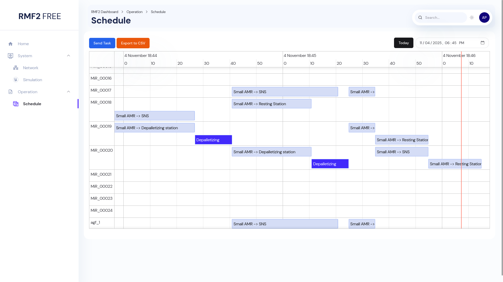
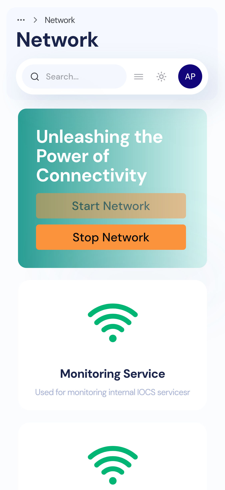

# RMF2 UI

React Library and Sample Web Dashboard for RMF2

<p>
  
  
</p>

## Content

- [Project Structure](#project-structure)
- [Source Installation](#source-installation)
- [Usage](#usage)
  - [Quick Start](#quick-start)
  - [Build and Preview](#build-and-preview)
  - [Other Useful Commands](#other-useful-commands)
- [Docker Usage](#docker-usage)

## Project Structure

This project follows a `pnpm` [monorepo structure](https://pnpm.io/workspaces).

- **apps**: Example apps built using `@rmf2-ui` components
  - **dashboard**: RMF2 sample dashboard

- **packages**: Packages here are generic functionality for RMF2 dashboard, all the packages here are prefixed with `@rmf2-ui`
  - **chakra**: `@rmf2-ui/chakra` package. This package contains pre-built RMF2 React components using [Chakra UI](https://chakra-ui.com/)
  - **client**: `@rmf2-ui/client` package. This package contains generated OpenAPI TS Client and some helper functions.
  - **data**: `@rmf2-ui/data` package. This package contains basic TS and JS data structure used by all other packages.

## Source Installation

Install `pnpm` (10 and later) and `NodeJS` (22 and later)

```bash
curl -fsSL https://get.pnpm.io/install.sh | sh -
source ~/.bashrc
pnpm env use --global 24
```

Clone the repo

```bash
git clone git@github.com:ros-industrial/rmf2-ui.git
cd rmf2-ui
```

Install dependencies

```bash
pnpm install
```

## Usage

### Quick Start

Serve the dashboard.

```bash
pnpm start
```

The sample dashboard is accessible at <http://localhost:3000>.

> [!NOTE]
> This command forces a clean rebuild of all the `@rmf2-ui/*` packages.
> Watch is also disabled by default for these packages.
> Only changes to the `dashboard` package gets live update to the webpage.

### Build and Preview

Build all packages

```bash
pnpm build
```

Preview dashboard

```bash
pnpm app preview --port 3000
```

### Other Useful Commands

Build all `@rmf2-ui/*` packages

```bash
pnpm --filter @rmf2-ui/* build
```

Build specific `@rmf2-ui` packages (For example, `@rmf2-ui/chakra`)

```bash
pnpm --filter @rmf2-ui/chakra build

# or

pnpm chakra build
```

Enable live update for `@rmf2-ui` packages

```bash
pnpm --filter @rmf2-ui/chakra build --watch

# or

pnpm chakra build --watch
```

> [!NOTE]
> This requires additional system resources that may be utilized by your IDE performance.

Launch the dashboard

```bash
pnpm app dev
```

## Docker Usage

Run the dashboard

```bash
docker run -p 3000:80 --rm ghcr.io/ros-industrial/rmf2-ui/dashboard:main
```

The sample dashboard is accessible at http://localhost:3000. For more information, check out the [detail docker instructions](./docs/docker.md).

## Contribution Guidelines

- [Contributor Documentation](./CONTRIBUTING.md).
